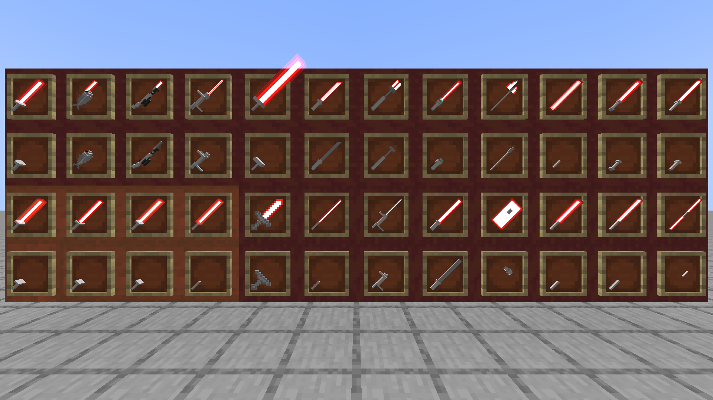

# ToLaserBlade-ExtraModels

A ToLaserBlade add-on to add more laser blade shapes.

## Requirements

### To Play

- ToLaserBlade (Forge) v6.0.0.0+/(NeoForge) v8.3.0+/(Fabric) v0.7.0.4+

### To Build

- [ToLaserBlade (Forge)](https://github.com/Iunius118/ToLaserBlade) v1.19.3-6.0.1.0

## Download Mods

- [From CurseForge](https://www.curseforge.com/minecraft/mc-mods/tolaserblade-extramodels)

## Licenses

- MIT license
